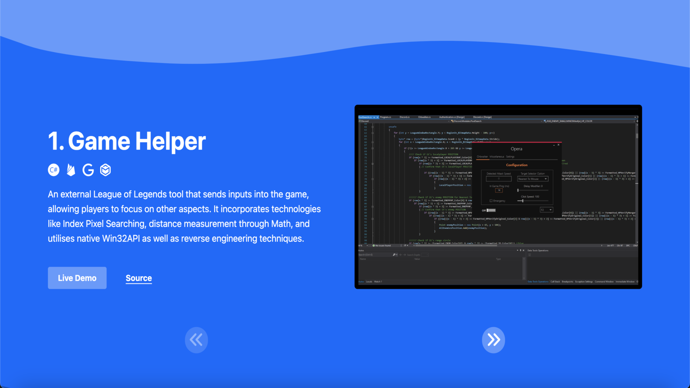
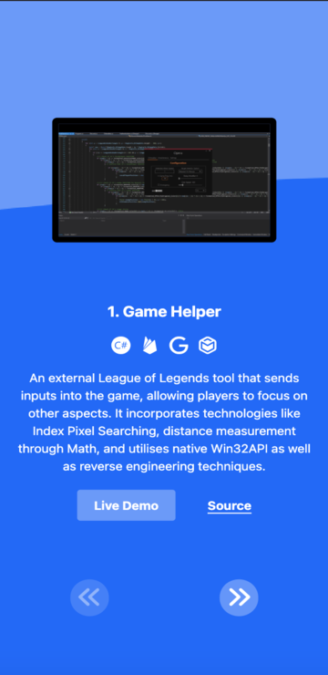

	<h1>Zhenkai's Portfolio v1
	 
		
		
		
		
		
		 
	</h1>
	<h3><b><a href="https://hzk2021.github.io/portfolio">View Live Demo</a></b></h3>

## Description

Zhenkai's portfolio site.

## Built Using

- React 
- TypeScript 
- Tailwind 
- Webpack 
- Babel 

#### Libraries

- [Framer Motion](https://www.framer.com/motion/)

#### Icons

- [React Icons](https://github.com/react-icons/react-icons)
- [FontAwesome](https://fontawesome.com/)
- [Simple Icons](https://simpleicons.org/)

#### Other

- [FranksLaboratory](https://www.youtube.com/watch?v=2F2t1RJoGt8)

## Preview

#### Desktop

#### Mobile

